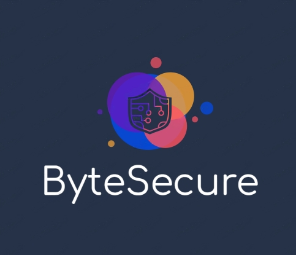

# Cybersecurity Awareness Hub - Home

---

[Home](index.md) | [Cyber-Security Videos Catalog](cybersecurity.md) | [Vote Of Thanks/About](about.md)

## Guarding Your Digital World: Cybersecurity Awareness Matters

Welcome to our cybersecurity awareness hub! We're dedicated to providing you with essential knowledge, tips, and resources to protect your digital life. Explore our content to stay informed about the latest cyber threats and learn how to keep your online presence secure. Join us in the fight against cyber threats and stay safe in the digital age.

In our interconnected world, technology touches every aspect of our lives. Cybersecurity is vital as threats evolve and impact individuals, businesses, and governments. From identity theft to data breaches, the consequences are dire. Protecting your digital life is not a convenience but a necessity. Cybersecurity awareness provides the tools and knowledge to secure our online experiences, making them safe and reliable.
